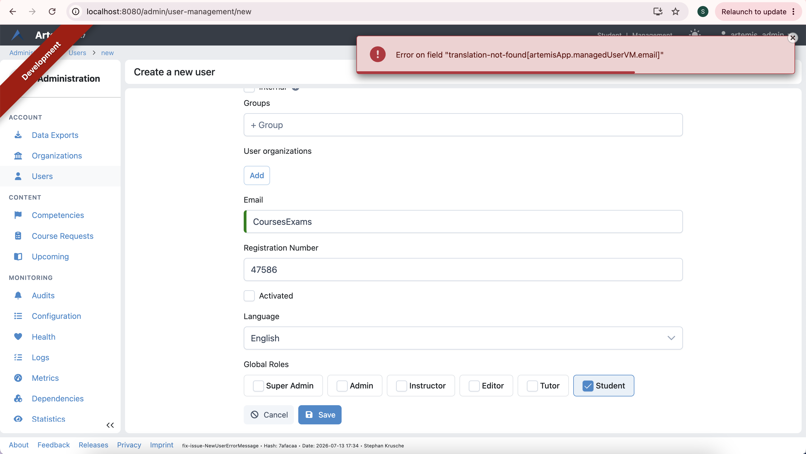

# Contribution 2: Creating a new user, non-translated error key

**Contribution Number:** 2  
**Student:** Sarah Nasser \
**Issue:** https://github.com/ls1intum/Artemis/issues/12187
**Status:** Phase II Complete

---

## Why I Chose This Issue

I chose this issue because I am interested in web development, especially UI/UX design. I enjoy ensuring that everything, including error messages, in a web application's UI/UX design are clear to users. I believe that if a user includes an invalid input for a field (e.g., an email field), the error message displayed should clearly explain why the input was invalid. I fully understand this issue, which is that the error message displayed for invalid email addresses when creating a new user as an admin do not clearly explain why an email address is invalid. This can confuse admins who do not understand why the email address they chose for a new user is invalid. Thus, for clarity purposes, error messages should clearly explain why an email address is invalid when an admin chooses an invalid email address when creating a new user. In concrete acceptance criteria, the issue is fixed if the error messages appear only when the email address is invalid (i.e., the error message does not contain a domain name, username, and exactly one "@" symbol), and if the error messages clearly explain why an email address is invalid if an admin creates a new user with an invalid email address.

This issue is specific and bounded, and I can resolve it within a couple of weeks. The languages for the repository hosting this issue are Java, TypeScript, and HTML. I am skilled in Java and HTML, and despite having no knowledge of TypeScript, I believe I can learn TypeScript within a few days. This issue has not been assigned to anyone, and no one has claimed it. There has been recent maintainer and team member activity in this repository, and no open pull requests are already solving this issue. The maintainer who posted this issue provided steps for reproducing the issue and showed a screenshot of how the issue looks on a web page (link to this post: https://github.com/ls1intum/Artemis/issues/12187#issue-3983732136). The maintainer's issue reproduction steps in order are to log in as a (super) admin, go to server management and then the Users Management page, create a new user, and fill in a nonvalid email address (I included more specific reproduction steps when completing Phase II). The maintainer's screenshot shows an invalid email address (abcd) and an unclear error message popup (Error on field "translation-not-found[artemisApp.managedUserVM.email]"). Additionally, the project has clear setup documentation that is compatible with my OS. I hope to learn TypeScript and gain more experience in coding with HTML and Java and making open-source contributions.

---

## Understanding the Issue

### Problem Description

When creating a new user as an admin with an invalid email pattern, the error message displayed is unclear and does not provide an explanation or visual feedback on why the email address is invalid.

### Expected Behavior

When creating a new user as an admin with an invalid email pattern, the error message displayed should be clear and provide an explanation or visual feedback on why the email address is invalid.

### Current Behavior

If a new user is created as an admin with invalid email address, the error message displayed is unclear and does not explain why the email address is invalid.

### Affected Components

The code segment I pasted below is involved. This code segment is in Artemis/Artemis/src/main/webapp/app/admin/user-management/update/user-management-update.component.html.
```
<div class="mb-3 flex flex-col gap-2">
  <label for="email" jhiTranslate="artemisApp.userManagement.email"></label>
  <input
  
    id="email"
    type="email"
    pInputText
    class="w-full"
    name="email"
    formControlName="email"
    [minlength]="EMAIL_MIN_LENGTH"
    required
    [maxlength]="EMAIL_MAX_LENGTH"
  />
  @if (editForm.get('email')!.dirty && editForm.get('email')!.invalid) {
    <div>
      @if (editForm.get('email')!.errors?.required) {
        <small class="text-state-danger" jhiTranslate="entity.validation.required"></small>
      }
      @if (editForm.get('email')!.errors?.maxlength) {
        <small
          class="text-state-danger"
          jhiTranslate="artemisApp.userManagement.inputConstraints"
          [translateValues]="{ min: EMAIL_MIN_LENGTH, max: EMAIL_MAX_LENGTH }"
        ></small>
      }
      @if (editForm.get('email')!.errors?.minlength) {
        <small
          class="text-state-danger"
          jhiTranslate="artemisApp.userManagement.inputConstraints"
          [translateValues]="{ min: EMAIL_MIN_LENGTH, max: EMAIL_MAX_LENGTH }"
        ></small>
      }
      @if (editForm.get('email')!.errors?.email) {
        <small class="text-state-danger" jhiTranslate="global.messages.validate.email.invalid"></small>
      }
    </div>
  }
</div>
```

This code segment provides logic for determining whether the email address is valid when creating a new user. There are conditional statements used to determine whether the email address is invalid, and if a conditional statement returns true, an error message is displayed. The error messages embedded into this code logic for invalid email addresses are unclear and do not explain why the email address is invalid.

---

## Reproduction Process

### Environment Setup

I learned from an Artemis Development Environment Setup guide linked in the README instructions for this open-source project. To set up my local development environment on Visual Studio Code, I downloaded and installed Java JDK 25 and Node.js LTS 24.18.0. I also ran "sudo corepack enable" so I would not have to manually follow the official pnpm installation steps. I then used Docker to set up a MySQL database. While setting up the MySQL database, I struggled with resetting the root password to an empty password. I was using the command "mysql -u root --execute "ALTER USER 'root'@'localhost' IDENTIFIED WITH caching_sha2_password BY ''";", and I asked Claude Code why my terminal was saying that the command "mysql" was not found. Claude told me that the mysql command-line client was installed only inside the Docker container and not on my Mac itself. Claude recommended me to use docker exec and the command "docker exec -it artemis-mysql mysql -u root --execute "ALTER USER 'root'@'localhost' IDENTIFIED WITH caching_sha2_password BY ''"" because my container was named artemis-mysql. This solution did not require me to install the mysql command-line client on my Mac itself. 

Next, I set up my server by creating application-local.yml in src/main/resources/config and copying and pasting configuration settings recommended by the development environment setup guide into application-local.yml. When trying to run the server with the command line using a Gradle wrapper (command: ./gradlew bootRun --args='--spring.profiles.active=dev,jenkins,localvc,artemis,scheduling,local,core'), the application was not getting executed, so I gave Claude my terminal output from trying to run the server and asked Claude the application is not being executed. Claude informed me that I should not be using tabs in application-local.yml, and Claude also recommended numerous configuration options that were not mentioned in this setup guide. After including the configuration options recommended by Claude and removing tabs from application-local.yml, I was able to run the server. Finally, I started client application in the browser using the command "pnpm start" and accessed the website on http://localhost:8080 in my Chrome browser.

### Steps to Reproduce

1. Include the YAML configuration code from the link https://docs.artemis.tum.de/admin/user-registration/ into application-local.yml, which is in src/main/resources/config, while not removing any of the preexisting code that is already in application-local.yml
2. Run the server with the command ./gradlew bootRun --args='--spring.profiles.active=dev,jenkins,localvc,artemis,scheduling,local,core'.
3. Once the website content becomes accessible on http://localhost:8080 in my Chrome browser, click the "Log in" button at the top right corner of the website to log in as a (super) admin.
4. Input the username "artemis_admin" and the password "artemis_admin" to log in as a (super) admin
5. Click on the profile link at the top right corner of the website, then click the button labeled "Administration"
6. Click on the "Create a new user" button
7. Fill in a nonvalid email address, e.g., CoursesExams
8. Fill in anything for the first name and last name that only consists of letters, e.g., Courses for the first name and Exams for the last name
9. Fill in a random number for registration number
10. Use any of the options provided (English or Deutsch) for the Language prompt
11. Choose any and as many of the options as you want (Super Admin, Admin, Instructor, Editor, Tutor, Student) in the global roles prompt
12. Click the "Save" button at the bottom of the "Create a new user" page
14. Observed result: An error message (Error on field "translation-not-found[artemisApp.managedUserVM.email]") is displayed at the top of the webpage. This error message is unclear and does not explain why the email address is invalid or how to make the email address valid.

### Reproduction Evidence

- **Commit showing reproduction:** https://github.com/SarahNasser576/Artemis/commit/74e4837c138367ca1e03b6181c3c49e8c3f8c369
- **Screenshots/logs:** 
- **My findings:** During reproduction, I found that the issue described by the maintainer still exists. The error message (Error on field "translation-not-found[artemisApp.managedUserVM.email]") displayed at the top of the webpage after logging in as a (super) admin is unclear and does not explain why the email address is invalid or how to make the email address valid. The correct behavior is that this error message should clearly explain why the email address is invalid or how to make the email address valid.
---

## Solution Approach

### Analysis

The error messages in the conditional statements, which display an error message if the new user's email address is invalid, (see the code segment above in the Affected Components subsection of the Understanding the Issue section) are unclear and do not clearly explain why the email address is invalid.

### Proposed Solution

I will keep the conditional statement for checking whether an email address was included when creating a new user (the first conditional statement in the code segment I pasted in the "Affected Components" subsection of the "Understanding the Issue" section above). In this conditional statement, if an email address, whether valid or invalid, was not included (empty text box in the email prompt), the "Save" button for saving a new user is unclickable, preventing a new user from being saved. The user also sees a message right below the email prompt that the email field is required. I will also keep the conditional statements for checking whether the new user's email address follows the length requirements (between the minimum length and maximum length, inclusive) (the second conditional statement in the code segment previously mentioned checks whether the email address is at least the minimum length, and the third conditional statement checks whether the email address is at most the maximum length). In these conditional statements, if the email address is shorter than the minimum length, the user gets a clear reminder right below the email prompt on the length requirements ("This field must contain 5 to 100 characters!"), and the "Save" button for saving a new user is unclickable, preventing a new user from being saved. Once the user types the maximum number of characters (100 characters) in the email field and tries to type another character, the webpage does not insert the 101th character the user tried to include. Thus, it is visibly clear that the new user cannot be created and why that is the case, if an email address, whether valid or invalid, is not included or if the email address does not follow the length requirements. I will include separate conditional statements for checking whether the new user's email address contains a domain name, username, and exactly one "@" symbol. If the email address does not contain exactly one "@" symbol, I will display an error message stating that the email address must contain exactly one "@" symbol. If the email address does not contain a domain name, I will display an error message stating that the email address must contain a domain name. If the email address does not contain a username, I will display an error message stating that the email address must contain a username.

### Implementation Plan

Using UMPIRE framework (adapted):

**Understand:** When new user as an admin gets created with an invalid email pattern, the error message displayed is unclear and does not provide an explanation or visual feedback on why the email address is invalid. I should make the error message clear and explain to the user why their email address is invalid or how to make their email address valid.

**Match:**

A related piece of code that does something similar to what I need is:
@if (editForm.get('email')!.errors?.email) {
  <small class="text-state-danger" jhiTranslate="global.messages.validate.email.invalid"></small>
}

This conditional statement states that if the new user's email address is invalid for any reason other than falling outside of the length requirements, an error message should be displayed. This error message does not clearly explain why the email address is invalid. This piece of code relates to my plan below because my plan will use multiple conditional statements to check for whether the email address is invalid and display an error message that clearly explains why that is the case. My plan will include one conditional statement for checking whether the email address contains exactly one "@" symbol, one conditional statement for checking whether the email address contains a domain name, and one conditional statement for checking whether the email address contains a username. Unlike the project's current behavior, each of these three errors will result in its own customized error message on why the email address is invalid. If the email address does not contain exactly one "@" symbol, the error message should state that the email address should contain exactly one "@" symbol. If the email address does not contain a domain name, the error message should state that the email address should contain a domain name. If the email address does not contain a username, the error message should state that the email address should contain a username.

**Plan:**
1. Modify Artemis/Artemis/src/main/webapp/app/admin/user-management/update/user-management-update.component.html to implement the the following email address validation logic steps in the exact order listed below.
2. Keep the following three conditional statements (these should remain the first three conditional statements in the email address validation logic; see in my high-level proposed solution above what these three conditional statements do and why including an email address outside of the length limits or not including an email address does not confuse the user):
@if (editForm.get('email')!.errors?.required) {
  <small class="text-state-danger" jhiTranslate="entity.validation.required"></small>
}
@if (editForm.get('email')!.errors?.maxlength) {
  <small
    class="text-state-danger"
    jhiTranslate="artemisApp.userManagement.inputConstraints"
    [translateValues]="{ min: EMAIL_MIN_LENGTH, max: EMAIL_MAX_LENGTH }"
  ></small>
}
@if (editForm.get('email')!.errors?.minlength) {
  <small
    class="text-state-danger"
    jhiTranslate="artemisApp.userManagement.inputConstraints"
    [translateValues]="{ min: EMAIL_MIN_LENGTH, max: EMAIL_MAX_LENGTH }"
  ></small>
}
4. Include an if-conditional statement that if the new user's email address does not contain exactly one "@" symbol, display the error message, "Error: The email address must contain exactly one "@" symbol."
5. Include an if-conditional statement that if the new user's email address does not contain a domain name, display the error message, "Error: The email address must contain a domain name."
6. Include an if-conditional statement that if the new user's email address does not contain a username, display the error message, "Error: The email address must contain a username."

**Implement:** https://github.com/SarahNasser576/Artemis/commits/fix-issue-NewUserErrorMessage/?author=SarahNasser576

**Review:**

- Did I reuse code if possible? (Answer to this question should be yes.)
- Did I duplicate code? (Answer to this question should be no.)
- Did I write meaningful and comprehensive tests? (see the "Evaluate" subsection below for the kinds of tests I will use) (Answer to this question should be yes.)
- Did I validate and sanitize data? (Answer to this question should be yes.)
- Does my code pass all formatting and linting checks? (Review this question once my code goes through linting and formatting checks on GitHub after PR submission. These checks will occur before maintainers consider merging my PR.) (Answer to this question should be yes.)
- Did I document my code appropriately? (Answer to this question should be yes.)
- Do all my error messages clearly explain why the new user's email address is invalid? (Answer to this question should be yes.)
- Do all my error messages only include what is necessary? (Answer to this question should be yes.)
- Do all my error messages avoid technical jargon? (Answer to this question should be yes.)
- Do all my error messages use uniform colors (Answer to this question should be yes.)
- Do all my error messages use semantic tokens for colors (Ideally, all the error messages are red, just like they are currently in this project.) (Answer to this question should be yes.)
- Do all my error messages use uniform spacing? (Answer to this question should be yes.)
- Do all my error messages use uniform icons? (Answer to this question should be yes.)

**Evaluate:** After signing in as a (super) admin, I will attempt many times to create a new user. One of these attempts will be with a valid email address. I should expect to see no error messsage if the email address is valid. The other attempts will be invalid email addresses, each of these invalid attempts with a different issue that would make an email address invalid (e.g., no domain name, no "@" symbol, no username, more than one "@" symbol). In all the attempts with invalid email addresses, an error message should be displayed and should be clear and explain why the email address is invalid. Due to there being various issues that can make an email address invalid, there will need to be a customized error message for each type of reason why an email address is invalid. For example, if the email address had a domain name but is invalid due to not containing an "@" symbol, the error message should state the exact reason for why the email address is invalid and should not say that the email address is invalid due to not containing a domain name. Another example is that if the email address has neither a domain name nor an "@" symbol, the error message should state that the email address is invalid due to containing neither an "@" symbol nor a domain name.

---

## Testing Strategy

### Unit Tests

- [ ] Test case 1: [Description]
- [ ] Test case 2: [Description]
- [ ] Test case 3: [Description]

### Integration Tests

- [ ] Integration scenario 1
- [ ] Integration scenario 2

### Manual Testing

[What you tested manually and results]

---

## Implementation Notes

### Week [X] Progress

[What you built this week, challenges faced, decisions made]

### Week [Y] Progress

[Continue documenting as you work]

### Code Changes

- **Files modified:** [List]
- **Key commits:** [Links to important commits]
- **Approach decisions:** [Why you chose certain approaches]

---

## Pull Request

**PR Link:** [GitHub PR URL when submitted]

**PR Description:** [Draft or final PR description - much of the content above can be adapted]

**Maintainer Feedback:**
- [Date]: [Summary of feedback received]
- [Date]: [How you addressed it]

**Status:** [Awaiting review / Iterating / Approved / Merged]

---

## Learnings & Reflections

### Technical Skills Gained

[What you learned technically]

### Challenges Overcome

[What was hard and how you solved it]

### What I'd Do Differently Next Time

[Reflection on your process]

---

## Resources Used

- [Link to helpful documentation]
- [Tutorial or Stack Overflow post that helped]
- [GitHub issues or discussions that helped]
